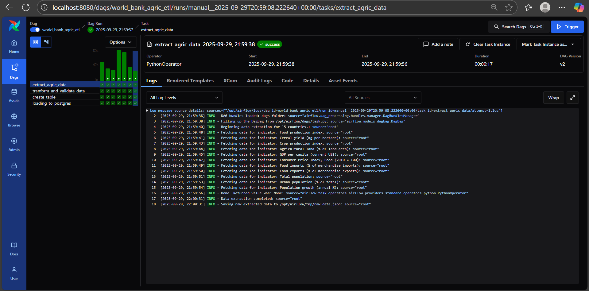
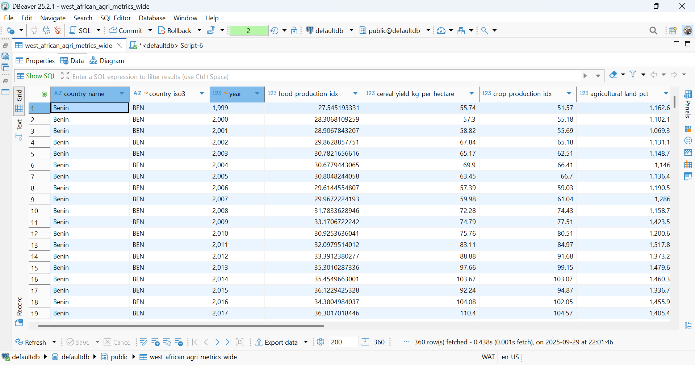
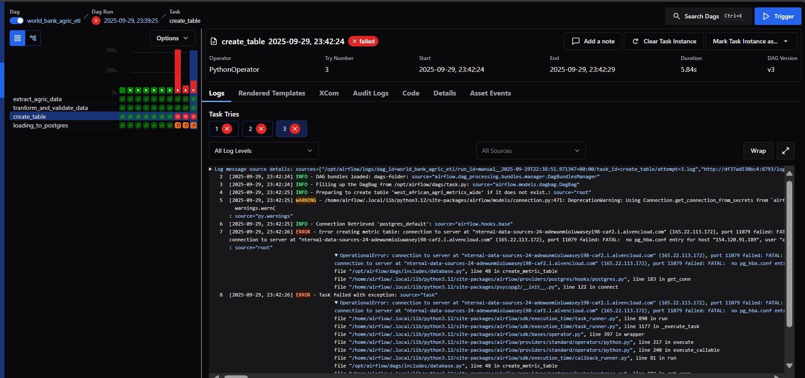
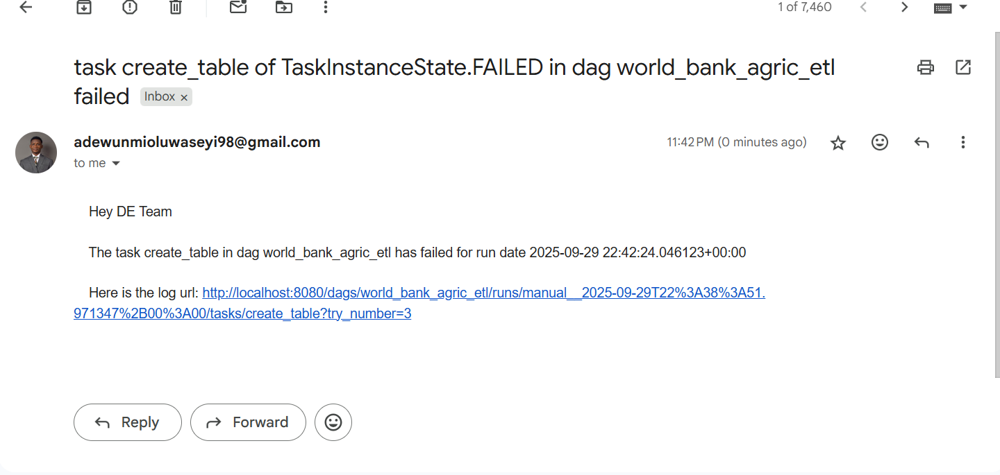

### Pricepally Assessment – World Bank Data ETL Pipeline

This repository contains an ETL pipeline built with Apache Airflow for extracting, validating, transforming, and loading World Bank Development Indicators into a PostgreSQL database.

The project is scoped around agriculture, economic access, trade, and population metrics relevant to ECOWAS countries. By consolidating these datasets into a wide-format PostgreSQL table, analysts and data scientists can easily query, report, and model key development indicators.

----
### Problem Statement
Bee-Agro Allied lacks an automated system to collect and process agricultural, economic, and demographic data for West Africa. Without a robust data pipeline, the organization cannot efficiently support reporting and predictive modeling for food supply, economic access to food, and population-driven demand, hindering data-driven decision-making in the region.

### Solution


### Data Source

World Bank API (https://data.worldbank.org/) as the primary data source.

Why World Bank?
- Free, open, and standardized.
- Provides consistent socio-economic, agricultural, and demographic indicators.
- Supports multi-country queries for regional analysis.

### Transformations
The DAG performs these transformations:
- Extract → Query the World Bank API for each indicatos & country for a specified range of years.
- Normalize → Convert JSON to pandas DataFrame.
- Pivot → Reshape into a wide table:

        Rows → Country & Year
        Columns → Indicators (renamed with snake_case from   indicators_column_names)

- Data Validation → Ensure data consistency and integrity

- Load → Insert into PostgreSQL table:

        Target table: west_african_agri_metrics_wide

- Notification → email alerting for failed task

---

### Technologies Used

- Python – ETL business logic

- PostgreSQL – Target storage

- Airflow – Orchestration and scheduling

- Docker + Docker Compose – Reproducible local setup

----
### Repository Structure
```graphql
├── .github/                  # CI/CD to remote server 
├── dags/                     # Airflow DAG definitions
│   └── task.py               # Main DAG 
│
├── includes/                 # ETL business logic
│   ├── database.py           # Postgres table creation + loading logic
│   ├── extraction.py         # World Bank API data fetch & transform
│   └── validation.py         # Pandera schema validation
│
├── util/                     # Configs & shared utilities
│   └── config.py             # Countries, indicators, DB table name, constants
│
├── notification/             # Notification helpers
│   └── email_alert.py        # Email alerts for ETL failures
│
├── docker-compose.yaml       # Local Airflow/Postgres services
├── Dockerfile                # Custom Airflow image
├── requirement.txt           # Python dependencies

```

---

### Setup & Run Locally
1. Clone the repository
```bash
git clone https://github.com/your-username/pricepally-etl.git
```
2. Build and Start services with Docker Compose
```bash
docker compose build
docker compose up
```

3. Access Airflow UI
```bash
http://localhost:8080
```

4. Configure Connections in Airflow UI
```bash
Postgres Connection

Go to Admin → Connections → +

Connection ID: "postgres_default"

Connection Type: "Postgres"

Host: "host_url"

Schema: "yourschema"

Login: "yourlogin"

Password: "yourpassword"

Port: 5432
```

5. Configure variable in Airflow UI
```bash
Notification variables

Go to Admin → Variables → +
# email_sender
key: "email_sender"
value: "email address"

# email_password
key: "password_email"
value: "email app password"

# email_receiver
key: "email_receiver"
value: "email address"
```
---

### Outcome

Once deployed, this pipeline provides a clean, validated, wide-format dataset containing agriculture, economy, trade, and population indicators for ECOWAS countries.

--- 
Dag Run


---
Database Data View


---
Failed Task and Alert





----
This dataset supports:

- Business reporting (supply-demand trends)

- Policy evaluation (trade/import dependencies)

- Predictive modeling (population-driven demand forecasting)