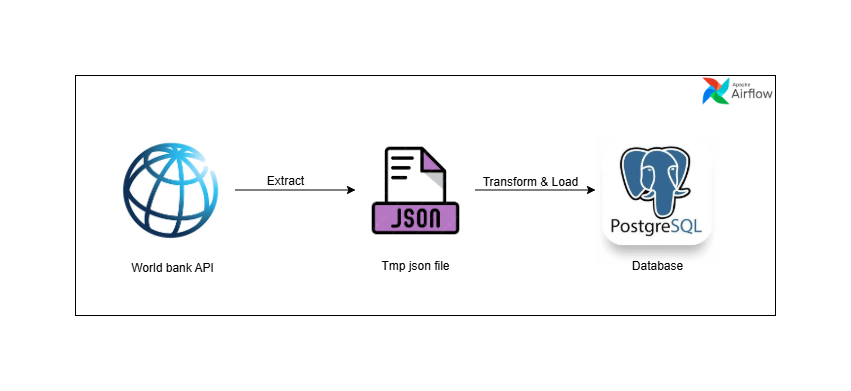

### Pricepally Assessment – World Bank Data ETL Pipeline

This repository contains an ETL pipeline built with Apache Airflow for extracting, validating, transforming, and loading World Bank Development Indicators into a PostgreSQL database.

The project is scoped around agriculture, economic access, trade, and population metrics relevant to ECOWAS countries. By consolidating these datasets into a wide-format PostgreSQL table, analysts and data scientists can easily query, report, and model key development indicators.

----
### Problem Statement
 A Bee-Agro Allie wants to develop a robust data pipeline that collects, cleans, and
 structures data from reliable external sources (such as the World Bank) to support reporting and
 predictive modeling around food supply, economic access to food, and population-driven demand in
 Africa.



### Features

- Extract → Fetch raw JSON data from the World Bank API.
- Validate → Use Pandera schemas to enforce data quality.
- Transform → Pivot long-format indicators into a wide DataFrame with standardized column names.
- Load → Insert data into PostgreSQL using a COPY + upsert strategy for efficiency.
- Notification → Email alerts for failed airflow task

---

### Technologies Used

- Python – Core ETL logic

- Pandas – Transformation & pivoting

- Pandera – Data quality validation

- Postgres – Database storage

- Airflow – Orchestration & scheduling

- Docker – Reproducible environment

----
### Repository Structure
```graphql

├── dags/                     # Airflow DAG definitions
│   └── task.py               # Main DAG 
│
├── includes/                 # ETL business logic
│   ├── database.py           # Postgres table creation + loading logic
│   ├── extraction.py         # World Bank API data fetch & transform
│   └── validation.py         # Pandera schema validation
│
├── util/                     # Configs & shared utilities
│   └── config.py             # Countries, indicators, DB table name, constants
│
├── notification/             # Notification helpers
│   └── email_alert.py        # Email alerts for ETL failures
│
├── docker-compose.yaml       # Local Airflow/Postgres services
├── Dockerfile                # Custom Airflow image
├── requirement.txt           # Python dependencies
└── README.md                 # Documentation (this file)

```

---

### Setup & Run Locally
1. Clone the repository
```bash
git clone https://github.com/your-username/pricepally-etl.git
cd pricepally-etl
```
2. Build and Start services with Docker Compose
```bash
docker compose build
docker compose up
```

3. Access Airflow UI
```bash
http://localhost:8080
```

4. Configure Connections in Airflow UI
```bash
Postgres Connection

Go to Admin → Connections → +

Connection ID: "postgres_default"

Connection Type: "Postgres"

Host: "host_url"

Schema: "yourschema"

Login: "yourlogin"

Password: "yourpassword"

Port: 5432
```

5. Configure variable in Airflow UI
```bash
Notification variables

Go to Admin → Variables → +
# email_sender
key: "email_sender"
value: "email address"

# email_password
key: "email_password"
value: "email app password"

# email_receiver
key: "email_receiver"
value: "email address"
```

